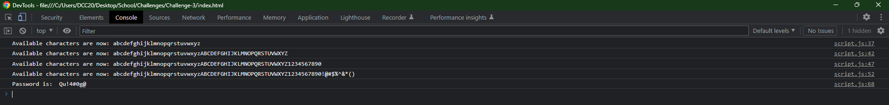

# Password Generator

## Description

The goal of this project was to implement a function to add functionality to a random password generator. At this point in time the site is fully functional, and has code already implemented to check what the program is doing via the console.

## Usage

To use the program, click the "Generate Password" button on screen. After clicking, the page will communicate with the user via dialouge boxes to decide what character types to include in the generated password.

## License

Please refer to the attatched licence in my repo.

## Features

-User will no longer be stuck in an infinite loop after clicking the generate key.

-Edge cases where no characher types were submitted automatically quit the function.

-User can see in console how the program is storing character selection, feature was left in for future-proofing. Password output to the console as well as the page.

